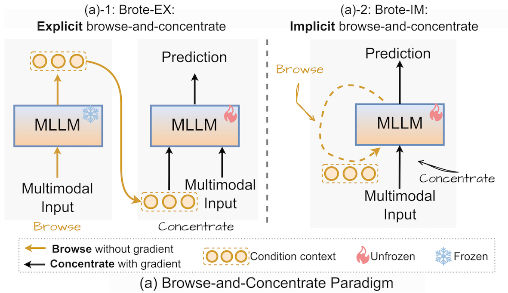
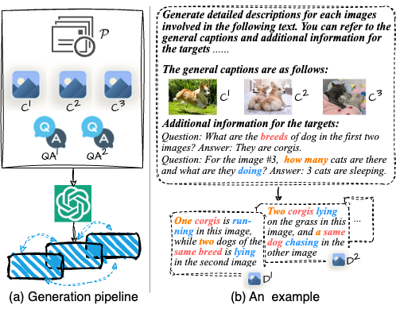
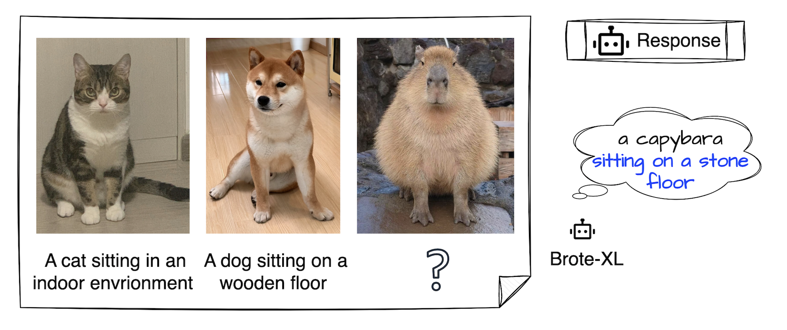

# 👀 Browse and Concentrate: Comprehending Multimodal Content via prior-LLM Context Fusion

[**🌐 Homepage**](https://thunlp-mt.github.io/Brote/) | [**📖 arXiv**](https://arxiv.org/pdf/2402.12195.pdf) | [**🤗 Models**](https://huggingface.co/wangphoebe/Brote-IM-XXL)

This repo includes codes and examples for paper [Browse and Concentrate: Comprehending Multimodal Content via prior-LLM Context Fusion](https://arxiv.org/pdf/2402.12195.pdf). 
## Activities

1. [2024-05-16] This paper is accepted by ACL 2024 (main conference). Information for our training data is updated.
2. [2024-04-18] Code and cases for data generation released. The generated data are used for pretraining.
3. [2024-03-18] Brote-IM-XXL model released, please download from this [link](https://huggingface.co/wangphoebe/Brote-IM-XXL). 
4. [2024-02-26] Project released.

## Framework
We propose a paradigm **Bro**wse and Concentra**te** (**Brote**) for incorporating multimodal context before feeding features into the LLM, together with two approaches to implement our paradigm, Brote-EX and Brote-IM. The model structures are shown in the following figure.



## Instructions For Training and Inference

### Data
Please refer to the data format described in [MIC](https://github.com/HaozheZhao/MIC).

1. Data for pretraining.

We create a dataset of 56k fewshot data samples, resulting in 191k training instances (one image per instance). These instances are supposed to contain question-aware and cross-image information. The data construction pipeline is illustrated in the following figure.



If you want plan to try our constructed pretraining data, please create an issue here. We will contact you ASAP.  

2. Data for finetuning.

We sampled about 500k data from MIC for model finetuning.

### Environment
```
pip install -r requirements.txt
```

### Training
coming soon

### Inference
Please refer to the test.py file; files under the **model** dir are for test only, and will be updated soon for training.

To run the test script (ensure the required libraries are properly installed):
```
export CUDAID='please set you cuda id here'
export TASKID='please set the case id (from 1 to 5), or use the string 'all'(lowercase)'
CUDA_VISIBLE_DEVICES=$CUDAID python test.py $TASKID 
```

## Example


(🐱 in this figure is a 6-year-old cat, his name is Alan.)

## Models
Please download our model from [**🤗 Models**](https://huggingface.co/wangphoebe/Brote-IM-XXL).

## Reference

📑 If you find our project helpful to your research, please consider citing:
```
@inproceedings{
anonymous2024browse,
title={Browse and Concentrate: Comprehending Multimodal Content via Prior-{LLM} Context Fusion},
author={Anonymous},
booktitle={The 62nd Annual Meeting of the Association for Computational Linguistics},
year={2024},
url={https://openreview.net/forum?id=K1Wf0vKps3}
}
```
## Acknowledgement
Our models are build upon [MMICL](https://github.com/HaozheZhao/MIC) and [InstructBLIP](https://github.com/salesforce/LAVIS/tree/main/projects/instructblip).
