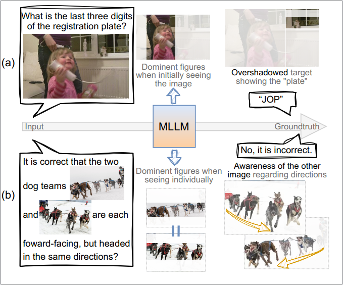
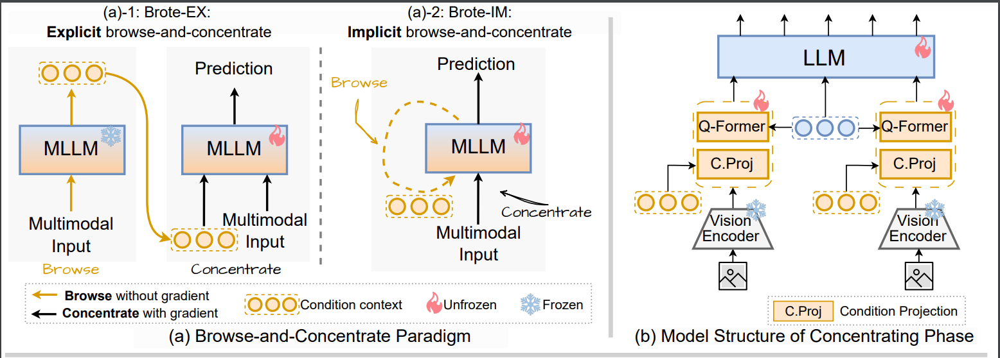
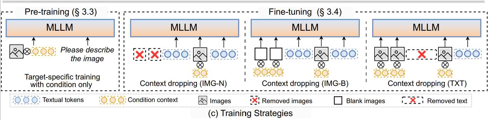

<strong>
    Browse and Concentrate:  Comprehending Multimodal Content via prior-LLM Context Fusion
</strong>

 

    Ziyue Wang1*,
    Chi Chen1*,
    Yiqi Zhu1, Fuwen Luo1, 
    Peng Li2†,
    Ming Yan3,
    Fei Huang3†,
    Maosong Sun1,
    Yang Liu1,2

 

    1 Department of Computer Science and Technology, Tsinghua University, Beijing, China 
    2 Institute for AI Industry Research (AIR), Tsinghua University, Beijing, China 
    3 Institute of Intelligent Computing, Alibaba Group 

 

    * Equal contribution 
    † Corresponding authors 

 

    <a href="https://arxiv.org/pdf/2402.12195.pdf" target="_blank"><strong>📖 arXiv</strong></a> |
    <a href="https://github.com/THUNLP-MT/Brote" target="_blank"><strong> <i class="fab fa-github"></i> Github</strong></a> |
    <a href="#" target="_blank"><strong>Models 🤗</strong></a>

 
 

<strong>
    Introduction
</strong>

With the bloom of Multimodal Large Language Models, the paradigm that extending Large Language Models with pre-trained vision encoders has shown remarkable abilities in visual reasoning and visual instruction-following tasks. However, this paradigm neglects essential crossmodality and inter-image interactions, leading to the LLM being presented with isolate visual and textual features without recognition of interleaved multimodal inputs, to which we refer as prior-LLM modality isolation and it obscures a deeper understanding of multi-image and interleaved inputs.

To mitigate the issue, we propose a novel paradigm named **Bro**wse-and-Concentra**te** (**Brote**). This paradigm begins with a browsing phase to generate a condition context vector, serving as a collection of browsing insights, encapsulating the main intent and visual information derived from images. Subsequently, a concentrating phase is employed to comprehend multimodal inputs, guided by the condition context vector. Our paradigm exhibits notable advancements, improving the average accuracy on 7 multi-image benchmarks by **2.13%** and **7.60%** against strong baselines with 3B and 11B LLMs, respectively.

    

 
 

<strong>
    Framework
</strong>

Our paradigm progressively comprehends images via two phases, browsing and concentrating. In the browsing phase, the MLLM browses the entire input and generates a condition context as the browsing result, denoted as _C_. Then, in the concentrating phase, the model comprehends multimodal inputs under the guidance of _C_. We refer to the model of browsing phase as _MB_ and the model of concentrating phase as _MC_.

Moreover, our proposed Brote can be further divided into two modes, explicit and implicit, regarding the distinct approaches of incorporating browsing result  _C_. The explicit version, denoted as **Brote-EX**, operates with separated parameters (_MB_ &ne; _MC_). This explicit mode first generates _C_ using _MB_, followed by _MC_ to infer the final outcomes. In contrast, for the implicit version, denoted as **BroteIM**, employs shared parameters for both phases (_MB_ =  _MC_), permitting  _MC_ to directly predict the answer without the need to explicitly produce intermediate vectors from the other model.

    

 
 

<strong>
    Trainging Strategies
</strong>

To encourage further exploration of information from _C_ for VL tasks, we propose a new training strategy named **context-dropping training**. The strategy intentionally omits particular inputs yet requiring the model to infer for answers solely with the assistant of _C_. It motivates the model to compensate for the missing information from the provided condition context _C_. We propose three different dropping strategies:
1. Drop images: This involves two approaches, removing certain images (**Context Dropping (IMG-N)**),  and replacing original images by blank placeholders (**Context Dropping (IMG-B)**).
2. Drop text: We remove the text before the last image (**Context Dropping (TXT)**).
3. Drop ALL: A combination of the above settings denoted as **ALL**, applied with the same probabilities.

    

 
 

<strong>
    Results
</strong>

    
We report our results in the following tables:

<table border="1" style="width:100%; text-align:center;">
  <tr>
    <th rowspan="2" style="text-align:center;">Model</th>
    <th rowspan="2" style="text-align:center;">#Param LLM</th>
    <th colspan="2" style="text-align:center;">In-context Learning</th>
    <th colspan="5" style="text-align:center;">Multi-image / Video Tasks</th>
    <th rowspan="2" colspan="1" style="text-align:center;">AVG</th>
  </tr>
  <tr>
    <th style="text-align:center;">VQA2</th>
    <th style="text-align:center;">A-OKVQA</th>
    <th style="text-align:center;">NLVR2</th>
    <th style="text-align:center;">DEMON</th>
    <th style="text-align:center;">SEED</th>
    <th style="text-align:center;">MSVD QA</th>
    <th style="text-align:center;">MSRVTT QA</th>
  </tr>
  <tr>
    <td>KOSMOS-1</td>
    <td>1.3B</td>
    <td>51.8</td>
    <td>-</td>
    <td>-</td>
    <td>-</td>
    <td>-</td>
    <td>-</td>
    <td>-</td>
    <td>-</td>
  </tr>
  <tr>
    <td>InstructBLIP-XL</td>
    <td>3B</td>
    <td>31.76*</td>
    <td>39.13*</td>
    <td>52.59*</td>
    <td>32.59*</td>
    <td>52.7</td>
    <td>43.40*</td>
    <td>12.12*</td>
    <td>37.77</td>
  </tr>
  <tr>
    <td>MMICL-XL</td>
    <td>3B</td>
    <td>69.16</td>
    <td>53.43*</td>
    <td><u>71.48</u>*</td>
    <td><strong>38.14</strong>*</td>
    <td>54.69*</td>
    <td><u>53.68</u></td>
    <td>42.36*</td>
    <td>54.71</td>
  </tr>
  <tr>
    <td>Otter</td>
    <td>7B</td>
    <td>45.39*</td>
    <td>38.42*</td>
    <td>49.54*</td>
    <td>24.51</td>
    <td>39.7</td>
    <td>25.87*</td>
    <td>9.78*</td>
    <td>-</td>
  </tr>
  <tr>
    <td>VPG-C-LLaMA2</td>
    <td>7B</td>
    <td>-</td>
    <td>-</td>
    <td>-</td>
    <td>37.22</td>
    <td>-</td>
    <td>-</td>
    <td>-</td>
    <td>-</td>
  </tr>
  <tr>
    <td>Flamingo-9B</td>
    <td>7B</td>
    <td>56.3</td>
    <td>-</td>
    <td>-</td>
    <td>-</td>
    <td>-</td>
    <td>30.2</td>
    <td>13.7</td>
    <td>-</td>
  </tr>
  <tr>
    <td>Brote-EX-XL</td>
    <td>3B</td>
    <td><strong>69.97</strong></td>
    <td><u>56.00</u></td>
    <td>71.41</td>
    <td>37.33</td>
    <td><u>57.51</u></td>
    <td>53.02</td>
    <td><u>43.14</u></td>
    <td><u>55.48</u></td>
  </tr>
  <tr>
    <td>Brote-IM-XL</td>
    <td>3B</td>
    <td><u>68.94</u></td>
    <td><strong>56.43</strong></td>
    <td><strong>76.02</strong></td>
    <td><u>37.34</u></td>
    <td><strong>57.86</strong></td>
    <td><strong>56.06</strong></td>
    <td><strong>45.08</strong></td>
    <td><strong>56.84</strong></td>
  </tr>
  <tr>
    <td>InstructBlip-XXL</td>
    <td>11B</td>
    <td>48.21*</td>
    <td>45.92*</td>
    <td>64.54*</td>
    <td>33.00*</td>
    <td>50.81*</td>
    <td>44.30*</td>
    <td>15.49*</td>
    <td>43.18</td>
  </tr>
  <tr>
    <td>MMICL-XXL</td>
    <td>11B</td>
    <td>70.56</td>
    <td>54.85*</td>
    <td>56.16*</td>
    <td>36.30*</td>
    <td>56.66*</td>
    <td>52.19</td>
    <td>39.46*</td>
    <td>52.18</td>
  </tr>
  <tr>
    <td>EMU-2</td>
    <td>33B</td>
    <td>67.0</td>
    <td>-</td>
    <td>-</td>
    <td>-</td>
    <td><strong>62.8</strong></td>
    <td>49.0</td>
    <td>31.4</td>
    <td>-</td>
  </tr>
  <tr>
    <td>Flamingo-80B</td>
    <td>70B</td>
    <td>63.1</td>
    <td>-</td>
    <td>-</td>
    <td>-</td>
    <td>-</td>
    <td>35.6</td>
    <td>17.4</td>
    <td>-</td>
  </tr>
  <tr>
    <td>Brote-EX-XXL</td>
    <td>11B</td>
    <td><u>70.86</u></td>
    <td><u>59.94</u></td>
    <td><u>70.42</u></td>
    <td><u>38.70</u></td>
    <td>59.31</td>
    <td><u>54.42</u></td>
    <td><u>45.24</u></td>
    <td><u>57.00</u></td>
  </tr>
  <tr>
    <td>Brote-IM-XXL</td>
    <td>11B</td>
    <td><strong>71.71</strong></td>
    <td><strong>60.31</strong></td>
    <td><strong>80.71</strong></td>
    <td><strong>38.94</strong></td>
    <td><u>61.64</u></td>
    <td><strong>57.29</strong></td>
    <td><strong>45.94</strong></td>
    <td><strong>59.78</strong></td>
  </tr>
</table>

    <ul>
        <li> The best results for models larger/smaller than 10B are separately <strong>bolded</strong> and the seconds are <u>underlined</u>.</li>
        <li>VQAv2 and A-OKVQA are conducted under four-shot setting.</li>
        <li>SEED refers to SEED-Bench that contains both images and videos.</li>
        <li>For video benchmarks, we uniformly extract eight frames from the given video clips for answering the questions.</li>
        <li>For "AVG", we first average the MME scores over its subtasks, then calculate the average scores of all benchmarks in this table. </li>
    </ul>

 

<table border="1" style="width:100%; text-align:center;">
  <tr>
    <th style="text-align:center;">Model</th>
    <th style="text-align:center;">#Param LLM</th>
    <th style="text-align:center;">VQAv2</th>
    <th style="text-align:center;">A-OKVQA</th>
    <th style="text-align:center;">ScienceQA-IMG</th>
    <th style="text-align:center;">MME Perception</th>
    <th style="text-align:center;">MME Cognition</th>
    <th style="text-align:center;">MMBench</th>
    <th style="text-align:center;">AVG</th>
  </tr>
  <tr>
    <td>InstructBLIP-XL</td>
    <td>3B</td>
    <td>36.77</td>
    <td><strong>54.57</strong></td>
    <td>70.40</td>
    <td>1093.70*</td>
    <td>281.43*</td>
    <td>69.68*</td>
    <td>68.52</td>
  </tr>
  <tr>
    <td>MMICL-XL</td>
    <td>3B</td>
    <td>69.13</td>
    <td>52.12*</td>
    <td><strong>72.58</strong>*</td>
    <td>1184.54*</td>
    <td>277.86*</td>
    <td>73.11*</td>
    <td>75.81</td>
  </tr>
  <tr>
    <td>LLaVA</td>
    <td>7B</td>
    <td>-</td>
    <td>-</td>
    <td>-</td>
    <td>457.82</td>
    <td>214.64</td>
    <td>36.2</td>
    <td>-</td>
  </tr>
  <tr>
    <td>Otter</td>
    <td>7B</td>
    <td>57.89*</td>
    <td>41.92*</td>
    <td>63.10</td>
    <td><strong>1292.26</strong></td>
    <td><strong>306.43</strong></td>
    <td>48.3</td>
    <td>69.51</td>
  </tr>
  <tr>
    <td>Brote-EX-XL</td>
    <td>3B</td>
    <td><u>69.90</u></td>
    <td>52.93</td>
    <td><u>71.15</u></td>
    <td><u>1203.87</u></td>
    <td><u>301.79</u></td>
    <td><u>73.27</u></td>
    <td><strong>77.18</strong></td>
  </tr>
  <tr>
    <td>Brote-IM-XL</td>
    <td>3B</td>
    <td><strong>70.24</strong></td>
    <td><u>53.40</u></td>
    <td><strong>72.58</strong></td>
    <td>1181.95</td>
    <td>266.79</td>
    <td><strong>74.29</strong></td>
    <td><u>75.90</u></td>
  </tr>
  <tr>
    <td>InstructBlip-XXL</td>
    <td>11B</td>
    <td>63.69</td>
    <td><u>57.10</u></td>
    <td>70.60</td>
    <td>1212.82*</td>
    <td>291.79*</td>
    <td>70.34*</td>
    <td>75.99</td>
  </tr>
  <tr>
    <td>MMICL-XXL</td>
    <td>11B</td>
    <td>70.30</td>
    <td>51.35*</td>
    <td>74.92*</td>
    <td><u>1313.88</u>*</td>
    <td><u>311.79</u>*</td>
    <td>76.58*</td>
    <td>80.41</td>
  </tr>
  <tr>
    <td>MMICL-XXL (BLIP2)</td>
    <td>11B</td>
    <td>69.99</td>
    <td>-</td>
    <td>-</td>
    <td><strong>1381.74</strong></td>
    <td><strong>428.93</strong></td>
    <td>65.24</td>
    <td>-</td>
  </tr>
  <tr>
    <td>Brote-EX-XXL</td>
    <td>11B</td>
    <td><u>71.58</u></td>
    <td>56.47</td>
    <td><u>77.69</u></td>
    <td>1279.73</td>
    <td>310.01</td>
    <td>76.67</td>
    <td><u>81.31</u></td>
  </tr>
  <tr>
    <td>Brote-IM-XXL</td>
    <td>11B</td>
    <td><strong>73.02</strong></td>
    <td><strong>57.83</strong></td>
    <td><strong>78.38</strong></td>
    <td>1284.13</td>
    <td>300.00</td>
    <td><strong>77.34</strong></td>
    <td><strong>81.66</strong></td>
  </tr>
</table>

    <ul>
        <li> The best results for models larger/smaller than 10B are separately <strong>bolded</strong> and the seconds are <u>underlined</u>.</li>
        <li>VQAv2 and A-OKVQA are conducted under zero-shot setting.</li>
        <li>ScienceQA is conducted under zero-shot CoT (ZS-CoT) setting.</li>
        <li>For "AVG", we first average the MME scores over its subtasks, then calculate the average scores of all benchmarks in this table. </li>
    </ul>

 
 

<strong>
    Citation
</strong>

    
📑 If you find our project helpful to your research, please consider citing:

    <pre style="text-align: left;">
        @article{wang2024browse,
            title={Browse and Concentrate: Comprehending Multimodal Content via prior-LLM Context Fusion},
            author={Wang, Ziyue and Chen, Chi and Zhu, Yiqi and Luo, Fuwen and Li, Peng and Yan, Ming and Zhang, Ji and Huang, Fei and Sun, Maosong and Liu, Yang},
            journal={arXiv preprint arXiv:2402.12195},
            year={2024}
        }
    </pre>

